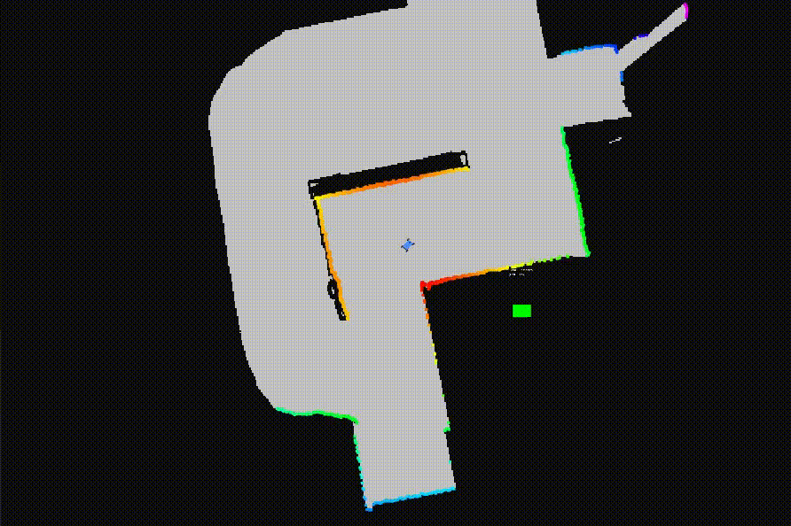
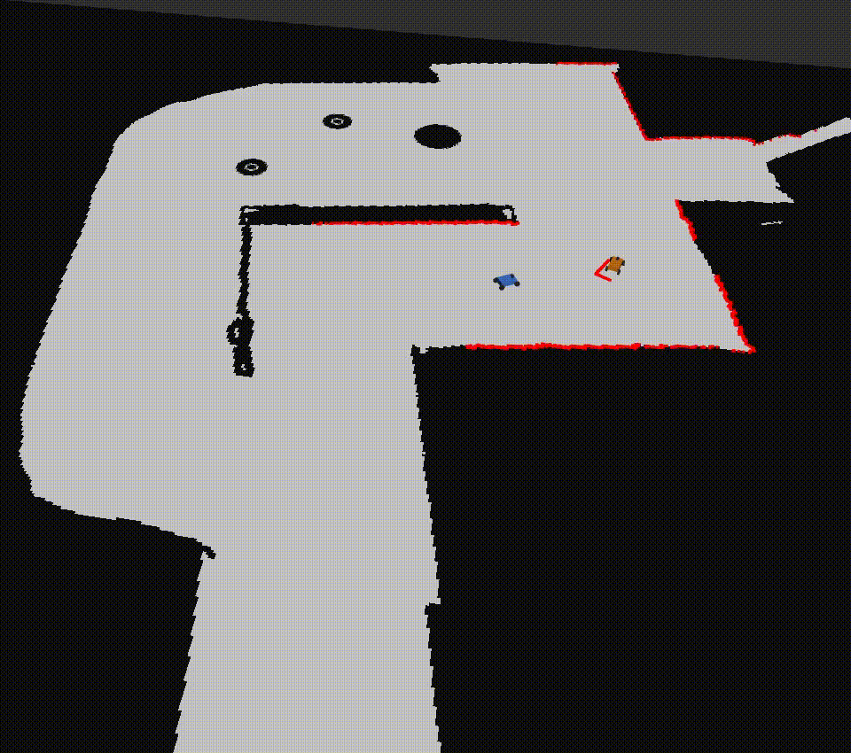

# Autonomous-Racing
This's a series of projects for UPenn ESE 615 (Autonomous Racing). You can download the code and use them on F1tenth racing car.

We implemented minimum curvature, CMA-ES and potential field method.

